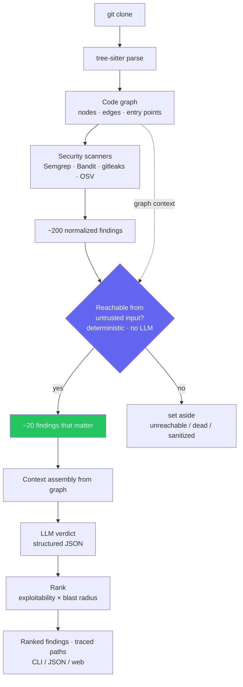

# Ravel

**Reachability-aware security triage for Python codebases.**

Ravel builds a knowledge graph of a Python codebase, then uses it to answer a question scanners can't: *which findings actually matter?* It does this by tracing whether flagged code is reachable from an untrusted entry point — turning a wall of ~200 scanner alerts into a short, ranked list of the ones that are real.

> **Status:** pre-build. Design is settled; implementation has not started.

---

## The problem

Security scanners report ~200 findings on a mid-size repo. Maybe ~8 are real — the rest are already sanitized, unreachable, or dead code. Teams check the first thirty, hit noise, and stop reading the report forever.

Detection was never the problem. Scanners read one file at a time and have no model of how the system connects. **Ravel builds that model first**, then filters findings by whether untrusted input can actually reach them.

**The claim we defend:** improve precision of scanner output **≥3×** while retaining **≥85%** of real vulnerabilities.

---

## What it does

One code graph, read three ways:

- **Which security findings matter?** — trace reachability from untrusted entry points.
- **What does this codebase do?** — auto-generated summaries that regenerate from the code.
- **What would a migration cost?** — deprecated APIs and outdated dependencies, classified by reachability.

The graph is the asset; everything else is an application of it.

---

## How it works



The **reachability filter is deterministic and LLM-free** — it's the core of the product. The LLM only adds a verdict on top of an already-filtered set, with graph context, and its output is structured JSON.

---

## Tech stack

| Layer | Choice |
|---|---|
| Parsing | tree-sitter (`py-tree-sitter`) |
| Name resolution | Jedi + `ast` |
| Import graph | `grimp` |
| Graph ops | NetworkX |
| Storage | Postgres + pgvector |
| Scanners | Semgrep OSS · Bandit · gitleaks · OSV-Scanner |
| LLM | Small model for summaries, larger for triage — swappable (local / BYO-key) |
| API | FastAPI |
| Frontend | Next.js + Tailwind + react-flow + dagre |

---

## Principles

- **Python only** for v1. Architecture stays language-agnostic.
- **Never write custom detection rules** — we wrap mature scanners and add the layer above.
- **Unresolved call edges are marked `unknown`, never dropped** — dropping them silently hides real vulnerabilities.
- **Coverage and recall are always reported next to precision** — the claims are only as good as the map.
- **Local-first, read-only.** Never requests write access. Never phones home.

---

## Scope (v1)

**In:** Python parsing · call + import graph · entry-point detection (Flask, FastAPI, Django) · scanner integration · reachability filtering · LLM triage · function/module summaries · deprecated-API + outdated-dependency reports · CLI + JSON + single-page web view · evaluation harness against CVE-patched repos.

**Not in v1:** patch generation · Q&A chat · non-Python languages · hosting/auth/multi-tenancy · custom detection rules · runtime data ingestion · cross-repo graphs.

---

## Repository layout (planned)

```
/src
  /ingest       clone, language detect, tree-sitter parsing
  /graph        node/edge construction, resolution, entry points
  /scanners     wrappers + normalization to Finding schema
  /triage       reachability, context assembly, LLM verdict, ranking
  /summarize    bottom-up summaries, hash-based caching
  /deps         deprecated API + outdated dependency analysis
  /store        Postgres models, migrations
  /cli          entry point
/web            Next.js frontend
/eval           benchmark repos, ground truth, one-command runner
/docs
```

---

## Documentation

- **[`docs/ROADMAP.md`](./docs/ROADMAP.md)** — plain-English, step-by-step tour of what we're building (start here).
- **[`PRODUCT.md`](./PRODUCT.md)** — the source of truth: data model, success metrics, non-negotiables, incremental-update logic, build order.
- **[`docs/BUILD-PLAN.md`](./docs/BUILD-PLAN.md)** — the phased, checkpoint-gated technical plan.
- **[`docs/reference/veloce-reuse-map.md`](./docs/reference/veloce-reuse-map.md)** — what we port / reference / drop from the Arcflow & CodeClean reference codebases.
- **[`AGENTS.md`](./AGENTS.md)** — tool-agnostic rules for AI coding agents contributing to Ravel.
